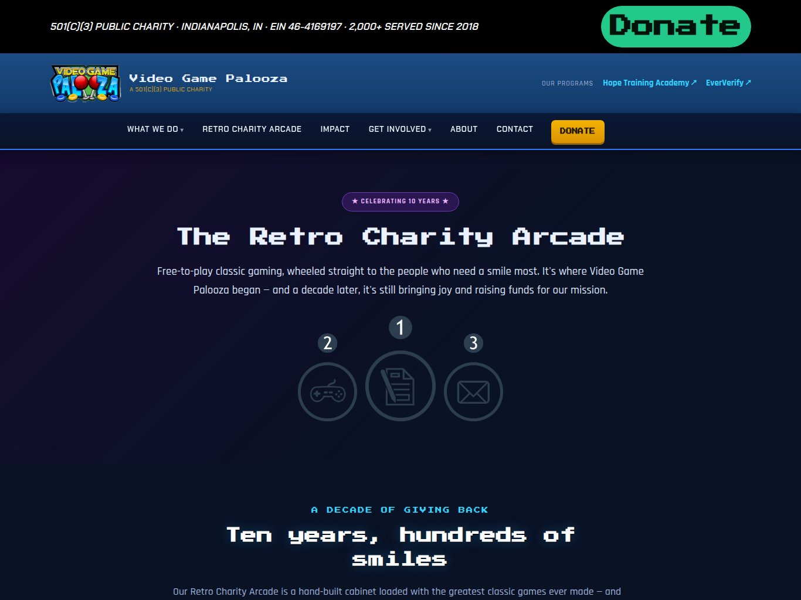

# Video Game Palooza — videogamepalooza.org

The website for **Video Game Palooza, Inc.** (d/b/a Hope Training Academy) — a 501(c)(3) public
charity in Indianapolis (EIN 46-4169197) that ends the cycle of poverty by training underserved
people for living-wage careers in the digital economy.

- **Live:** https://videogamepalooza.org
- **Stack:** [Astro](https://astro.build) (static) · Cloudflare Pages · Pages Functions (contact form → Resend)
- **The charity's programs (linked out):** Hope Training Academy (training/apprenticeship),
  EverVerify (digital-trust registry), and the 10-year Retro Charity Arcade.
- **Note:** a charitable public charity — **not a school** (advances education as a charitable activity,
  IRS 170(b)(1)(A)(vi)); wording synchronized with the board resolution & Microsoft nonprofit appeal.
- Full SEO (sitemap, robots, structured data) + legacy 301 redirects preserving prior search equity.

## Screenshots




## Develop

```bash
npm install
npm run dev
npm run build    # build to dist/ (also generates sitemap.xml)
```

Deploy: `npx wrangler pages deploy dist --project-name=videogamepalooza --branch=main`
